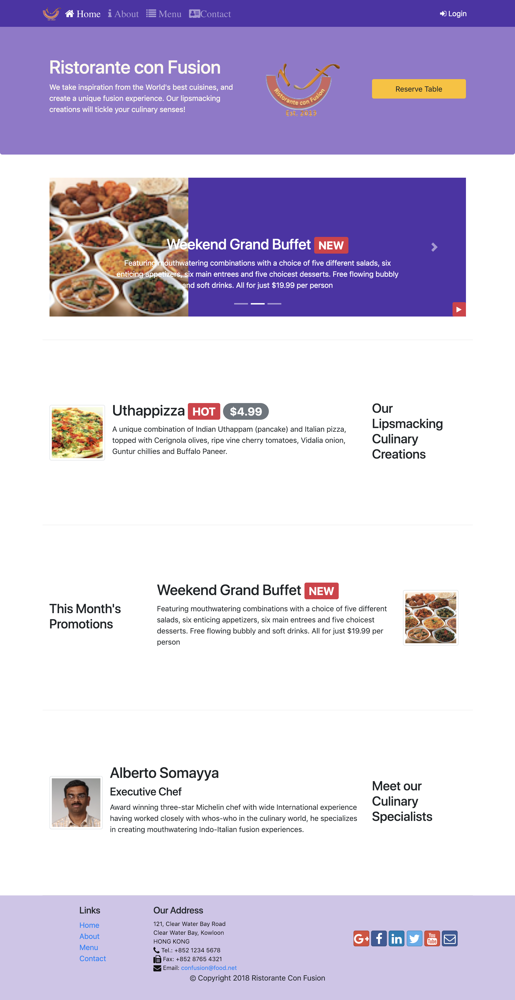

### Technologies use to build this page:
- HTML
- CSS
- Javascript
- Boostrap
- Bootstrap-Social
- Font-Awesome
- JQuery
- NodeJS
  - Sass
  - lite-server

### Desciption
This multipage project based mainly on bootstrap4. It uses a number of awesome bootstrap features, such as carousel.

### See Page on heroku:
<a href="https://pascal-newsletter-signup.herokuapp.com/">News Letter</a>

### Final Result:
